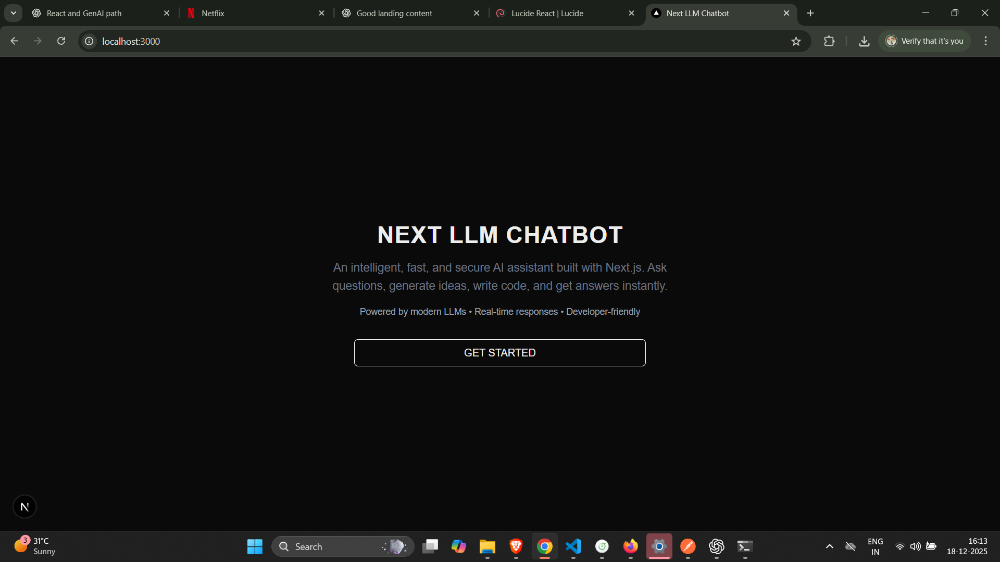
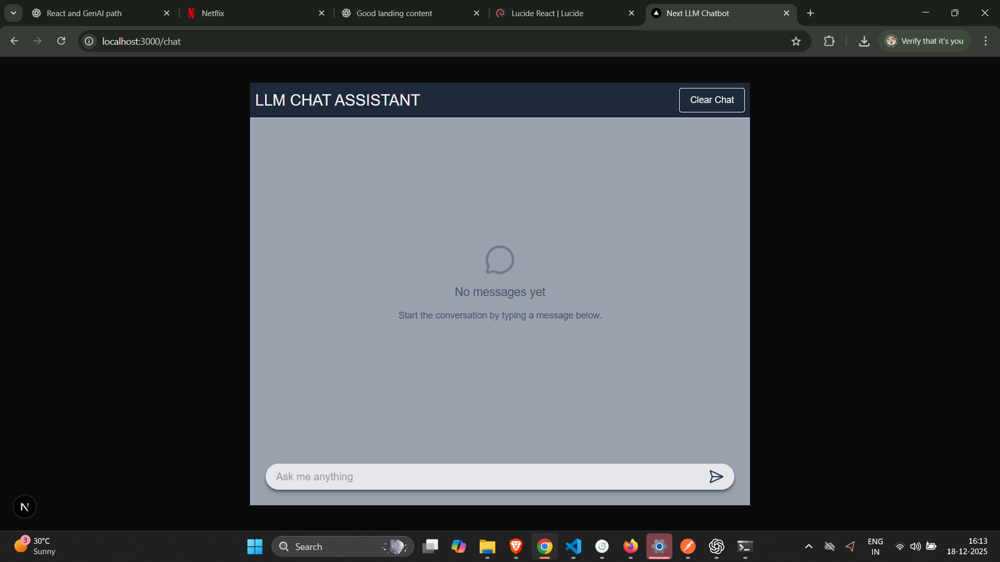
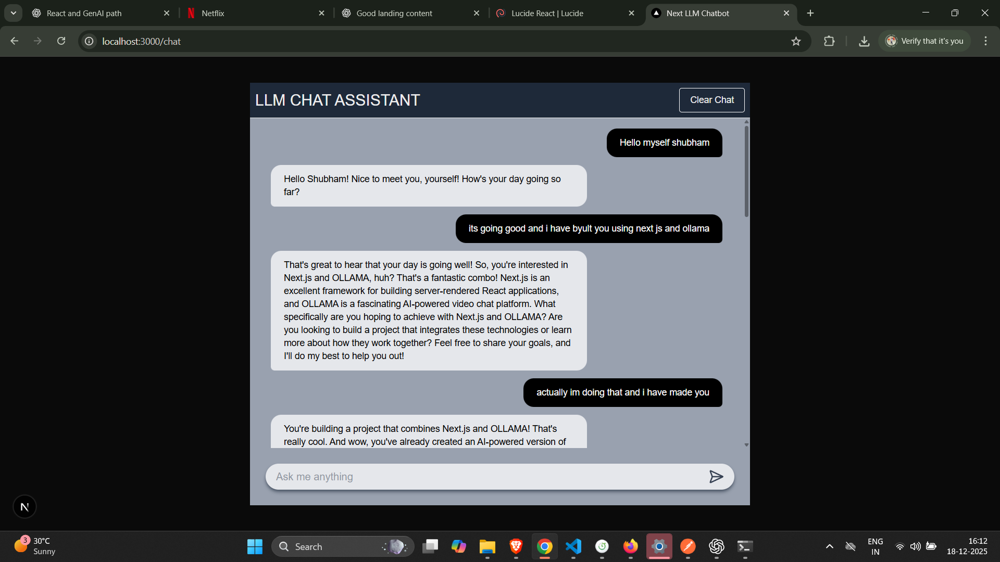

# 🤖 Next LLM Chatbot (Next.js + Ollama)

A modern, ChatGPT-style AI chat application built with **Next.js (App Router)** and powered by a **local Large Language Model (LLM)** using **Ollama**.  
This project demonstrates clean frontend architecture, **real-time streaming AI responses**, prompt engineering, and real-world GenAI application patterns.

---

## ✨ Features

- 🧠 AI-powered chat using a **local LLM (Ollama + LLaMA 3 / Phi-3)**
- 💬 Chat-style UI with user & assistant message bubbles
- ⚡ **Real-time streaming responses (token-by-token)**
- ⏳ Typing / thinking indicator during AI generation
- 💾 Persistent chat history using **browser localStorage**
- 🧩 Clean separation of concerns (UI, hooks, storage, API)
- 🎯 Structured **system prompt management**
- 🔌 LLM-agnostic backend design (easy to switch models/providers)

---

## 🛠 Tech Stack

- **Frontend:** React, Next.js (App Router)
- **Backend:** Next.js API Routes
- **LLM Runtime:** Ollama (local)
- **Models:** LLaMA 3 / Phi-3 (configurable)
- **State Management:** React Hooks
- **Persistence:** Browser `localStorage`
- **Streaming:** Fetch API + ReadableStream (NDJSON)
- **Styling:** CSS / Tailwind CSS

---

## 📂 Project Structure

```
src/
│
├─ app/
│   ├─ page.js                # Landing page
│   ├─ chat/
│   │   └─ page.js            # Chat UI page
│   │
│   └─ api/
│       └─ chat/
│           └─ route.js       # Streaming API → Ollama integration
│
├─ hooks/
│   └─ useChat.js             # Chat logic & streaming state management
│
├─ lib/
│   ├─ storage.js             # localStorage abstraction
│   ├─ prompts.js             # System prompt definitions
    └─ utils.js               # Utility functions
│
├─ components/
│   ├─ ChatBubble.jsx
|   ├─ ChatHeader.jsx
|   ├─ ChatMessage.jsx
|   └─ ChatFooter.jsx
│
└─ README.md
```

---

## ⚙️ How It Works

1. User sends a message from the chat UI  
2. Message is saved to React state and `localStorage`  
3. Recent conversation context (last N messages) is sent to `/api/chat`  
4. Backend API builds a prompt using a **system prompt + chat history**  
5. Ollama generates a response using **streaming mode**  
6. The API forwards the **NDJSON stream** directly to the client  
7. Frontend parses the stream and renders the response **token by token**  
8. Final response is saved and persisted  

---

## 🚀 Getting Started

### 1️⃣ Prerequisites

- **Node.js** (v18+ recommended)  
- **Ollama** installed → https://ollama.com  

Pull and run a model:

```bash
ollama run llama3
```

If you face CUDA/GPU issues on Windows, run Ollama in CPU mode:

```bash
set OLLAMA_NO_CUDA=1
ollama run llama3
```

---

### 2️⃣ Install Dependencies

```bash
npm install
```

---

### 3️⃣ Start the Development Server

```bash
npm run dev
```

Open:

- http://localhost:3000  
- http://localhost:3000/chat  

---

## 🦙 Ollama Configuration

- Ollama runs at: `http://localhost:11434`  
- Endpoint used: `POST /api/generate`  

Model selection in `app/api/chat/route.js`:

```js
model: "llama3"
```

or

```js
model: "phi3"
```

---

## 💾 Data Persistence

- Chat messages are stored in **browser localStorage**
- Messages persist across page refreshes
- Storage layer is abstracted for future DB integration

---

## 🧠 Design Decisions

- localStorage for rapid iteration
- Streaming responses for better UX
- NDJSON parsing for token-level updates
- System prompt abstraction for prompt control
- Context window limiting to avoid token bloat
- UUID-based message IDs
- Fetch API chosen for streaming compatibility

---

## 🔮 Future Improvements

- ⛔ Stop / cancel generation (AbortController)
- 🗂 Chat history summarization
- 🎛 Multiple prompt modes
- 🧠 RAG (document-based Q&A)
- 🔐 Authentication
- ☁️ Hosted LLM support
- 🚀 Production deployment

---

## 📸 Screenshots

  
  


---

## 👨‍💻 Author

**Shubham Kiran Raut**  
Frontend Developer | React | GenAI

---

⭐ If you like this project, consider giving it a star!
